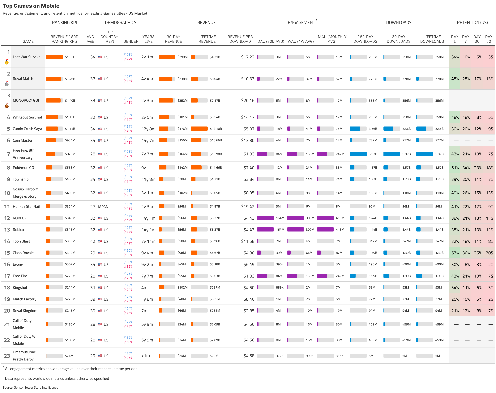

# sensortowerR

<p align="center"></p>

An R package for interfacing with the Sensor Tower API to fetch mobile app analytics data, including app info, publisher details, revenue/download estimates, active user metrics, and professional dashboard generation.

## Installation

```r
# Install from GitHub
devtools::install_github("econosopher/sensortowerR")
```

## Authentication

Store your Sensor Tower API token as an environment variable:

```r
# Edit your R environment file
usethis::edit_r_environ()

# Add this line (replace with your actual token):
# SENSORTOWER_AUTH_TOKEN="YOUR_SECRET_TOKEN_HERE"

# Restart R session for changes to take effect
```

The package automatically uses the `SENSORTOWER_AUTH_TOKEN` environment variable.

## Category Codes

Common category codes for use with API functions:

### iOS Categories
- `6000` - Games (general)
- `6014` - Games
- `6016` - Social Networking
- `7001` - Action (games)
- `7002` - Adventure (games)
- `7012` - Casino (games)
- `7014` - Role Playing (games)

### Android Categories
- `GAME` - Games
- `SOCIAL` - Social
- `game` - Games (lowercase)
- `game_action` - Action Games
- `game_adventure` - Adventure Games
- `game_casino` - Casino Games
- `game_role_playing` - Role Playing Games

For a complete list, use `st_categories()` to see available categories.

## Core Functions

- **`st_app_info()`**: Search for apps and get basic information
- **`st_publisher_apps()`**: Get all apps from a specific publisher  
- **`st_metrics()`**: Detailed daily metrics for specific apps
- **`st_top_charts()`**: Unified function for all top charts (revenue, downloads, DAU, WAU, MAU)
- **`st_game_summary()`**: Game market summary (aggregated downloads/revenue by categories and countries)
- **`st_category_rankings()`**: **NEW!** Get official app store rankings by category
- **`st_app_details()`**: **NEW!** Fetch comprehensive app metadata and store listings
- **`st_gt_dashboard()`**: Generate professional FiveThirtyEight-styled dashboards with one line of code

## Quick Examples

### Basic App Search
```r
# Search for apps
monopoly_info <- st_app_info("Monopoly Go")
pokemon_info <- st_app_info("Pokemon GO", limit = 1)
```

### Publisher Apps
```r
# Get all Supercell games
supercell_apps <- st_publisher_apps("560c48b48ac350643900b82d")
```

### App Metrics
```r
# Get recent metrics for a specific app
metrics <- st_metrics(
  unified_app_id = "your_app_id",
  start_date = Sys.Date() - 30,
  end_date = Sys.Date() - 1
)
```

### Category Rankings
```r
# Get official App Store rankings
ios_top_free <- st_category_rankings(
  os = "ios",
  category = 6014,  # Games
  chart_type = "topfreeapplications",
  country = "US",
  limit = 10
)

# Get Google Play top grossing games
android_top_grossing <- st_category_rankings(
  os = "android",
  category = "game",
  chart_type = "topgrossing",
  country = "US",
  limit = 20
)
```

### App Details
```r
# Get detailed metadata for specific apps
app_details <- st_app_details(
  app_ids = c("553834731", "1053012308"),  # Candy Crush, Clash Royale
  os = "ios"
)

# View key information
app_details %>%
  select(app_name, publisher_name, rating, price, description) %>%
  glimpse()
```

### Top Charts with Enhanced Metrics
```r
# Top apps by revenue (default measure)
top_revenue <- st_top_charts(category = 6000)  # iOS Games

# Top apps by downloads 
top_downloads <- st_top_charts(measure = "units", category = 6000)

# Top Role Playing games by MAU with rich analytics
top_rpg_games <- st_top_charts(
  measure = "MAU",
  category = 7014  # Role Playing category
)

# View enhanced custom metrics (40+ metrics available!)
top_rpg_games %>%
  select(unified_app_name, entities.users_absolute, 
         downloads_180d_ww, revenue_180d_ww, retention_1d_us, rpd_alltime_us) %>%
  head()
```

### Game Market Summary
```r
# Game market overview analysis
# iOS games market summary (last 7 days)
game_market <- st_game_summary(
  categories = 7001,           # Game category
  os = "ios",                  # iOS platform
  countries = c("US", "GB"),   # Multiple countries
  date_granularity = "daily",  # Daily breakdown
  start_date = Sys.Date() - 7
)

# Analyze market trends
# Note: iPhone and iPad data are automatically combined into iOS
market_trends <- game_market %>%
  group_by(Date) %>%
  summarise(
    Total_Revenue = sum(`iOS Revenue`, na.rm = TRUE),
    Total_Downloads = sum(`iOS Downloads`, na.rm = TRUE)
  )
```

## NEW: Professional Dashboard Generation

Create stunning FiveThirtyEight-styled dashboards with a single line of code:

```r
# Get top charts data
top_games <- st_top_charts(category = 7012)  # Casino games

# Generate dashboard with ONE line!
st_gt_dashboard(top_games)

# Customize the dashboard
st_gt_dashboard(
  top_games,
  title = "Top Casino Games - US Market",
  ranking_metric = "revenue_30d_ww",
  save_path = "casino_dashboard.png"
)

# Minimal styling for reports
st_gt_dashboard(top_games, raw = TRUE)
```

### Dashboard Features
- **Automatic ranking** by customizable metric
- **Bar charts** for revenue, downloads, and engagement metrics
- **Retention heatmaps** with color gradients
- **Country flag emojis** for international markets
- **Gender demographics** with visual breakdown
- **Smart formatting** with 2 decimal places for billions
- **FiveThirtyEight styling** or clean minimal mode

### Dashboard Parameters
- `title`: Custom title for the dashboard
- `subtitle`: Auto-generated or custom subtitle
- `ranking_metric`: Choose which metric to rank by
- `show_demographics`: Toggle demographic columns
- `show_engagement`: Toggle DAU/WAU/MAU columns
- `show_retention`: Toggle retention metrics
- `retention_region`: Choose retention region ("us", "ww")
- `bar_charts`: Enable/disable bar chart visualizations
- `heatmap_retention`: Enable/disable retention heatmaps
- `raw`: Return minimal styling without visualizations
- `save_path`: Save directly to PNG file
- `color_scheme`: Customize colors for different metric types

## Unified Top Charts Function

The `st_top_charts()` function combines revenue, downloads, and active user metrics in one simple interface:

```r
# All these use the same function with different measures:
st_top_charts(measure = "revenue", category = 6000)    # Default
st_top_charts(measure = "units", category = 6000)      # Downloads  
st_top_charts(measure = "MAU", category = 7014)        # Monthly Active Users
st_top_charts(measure = "DAU", category = 7014)        # Daily Active Users
```

## Enhanced Custom Metrics

The `st_top_charts()` function extracts comprehensive custom metrics:

- **Downloads**: `downloads_180d_ww`, `downloads_90d_us`, `downloads_30d_ww`, `downloads_alltime_ww`
- **Revenue**: `revenue_180d_ww`, `revenue_90d_us`, `revenue_30d_ww`, `revenue_alltime_ww`
- **Active Users**: `dau_30d_ww`, `wau_4w_ww`, `mau_month_ww`
- **Retention**: `retention_1d_us`, `retention_7d_us`, `retention_30d_us`, `retention_60d_us`
- **Monetization**: `rpd_alltime_us`, `arpu_90d_us`
- **Demographics**: `age_ww`, `male_share_us`, `female_share_us`
- **Platform**: `ios_share_ww`, `android_share_ww`

## Automatic Features

### App Name Lookup
For sales data (revenue/downloads), the package **automatically looks up app names** since the sales endpoint only provides app IDs:

```r
# Sales data automatically gets app names resolved
top_revenue <- st_top_charts(measure = "revenue", category = 6000)
# Returns: "Pokémon GO" instead of just "834731712"
```

### Intelligent Data Type Handling
The new functions ensure consistent data types for seamless joining:

```r
# Rankings return character app_ids, details also convert to character
# This allows direct joining without type conversion
rankings %>% left_join(details, by = "app_id")  # Works seamlessly
```

### App Deduplication
By default, apps with the same name but different platform/regional SKUs are consolidated:

```r
# Genshin Impact (8 different app IDs) becomes one row with aggregated metrics
top_games <- st_top_charts(category = 7014)
# Downloads/revenue are summed, rates/percentages are averaged
```

## Combining Functions for Enriched Data

The package is designed with composability in mind. Here's how to combine functions for richer insights:

### Enriching Rankings with App Details
```r
# Step 1: Get current rankings
rankings <- st_category_rankings(
  os = "ios",
  category = 6014,  # Games
  chart_type = "topgrossingapplications",
  limit = 10
)

# Step 2: Get detailed metadata for ranked apps
details <- st_app_details(
  app_ids = rankings$app_id,
  os = "ios"
)

# Step 3: Combine for enriched rankings
enriched_rankings <- rankings %>%
  left_join(details %>% 
    select(app_id, app_name, publisher_name, rating, 
           rating_count, release_date), 
    by = "app_id") %>%
  arrange(rank)

# View top grossing games with details
enriched_rankings %>%
  select(rank, app_name, publisher_name, rating, rating_count) %>%
  head(10)
```

### Complete Market Analysis Workflow
```r
# 1. Find a category from a known app
app_info <- st_app_info("Genshin Impact", return_all_fields = TRUE, limit = 1)
rpg_category <- app_info %>%
  tidyr::unnest(category_details) %>%
  filter(grepl("Role Playing", category_name)) %>%
  pull(category_id) %>%
  first()

# 2. Get current store rankings
current_rankings <- st_category_rankings(
  os = "ios",
  category = rpg_category,
  chart_type = "topgrossingapplications",
  limit = 20
)

# 3. Get performance metrics for top apps
top_metrics <- st_top_charts(
  measure = "revenue",
  category = rpg_category,
  regions = "US"
)

# 4. Get detailed app information
app_details <- st_app_details(
  app_ids = current_rankings$app_id[1:10],
  os = "ios"
)

# 5. Combine all data and create dashboard
combined_data <- current_rankings %>%
  left_join(app_details %>% select(app_id, app_name, publisher_name), by = "app_id") %>%
  left_join(top_metrics %>% select(app_id, revenue_30d_ww, mau_month_ww), by = "app_id")

# Generate professional dashboard
st_gt_dashboard(
  top_metrics,
  title = "RPG Games Market Analysis",
  save_path = "rpg_market_dashboard.png"
)
```

## Example Workflow: Social Casino Analysis

```r
# Load packages
library(sensortowerR)

# Find Social Casino category from a specific game
monopoly_info <- st_app_info("Monopoly Go", return_all_fields = TRUE, limit = 1)
social_casino_id <- monopoly_info %>%
  tidyr::unnest(category_details) %>%
  filter(grepl("Casino", category_name)) %>%
  pull(category_id) %>%
  first()

# Get top social casino games (US focus)
top_casino <- st_top_charts(
  measure = "revenue",
  category = social_casino_id,
  regions = "US"
)

# Create professional dashboard with one line
st_gt_dashboard(
  top_casino,
  title = "Top Social Casino Games - US Market",
  save_path = "social_casino_dashboard.png"
)
```

### Example Output: Social Casino Dashboard

The `social_casino_analysis.R` example generates a comprehensive analytics dashboard for top social casino games:

<p align="center"></p>

This dashboard showcases:
- **180-day Revenue Performance** - ranking metric with bar charts
- **User Engagement** - DAU, WAU, MAU with visual comparisons
- **Downloads Metrics** - 30-day, 180-day, and lifetime totals
- **Retention Rates** - Day 1, 7, 30, and 60 retention with heatmaps
- **Monetization** - Revenue Per Download (RPD) efficiency
- **Demographics** - Age and gender breakdowns

Additional visualizations generated:
- Revenue trend analysis
- DAU/MAU engagement ratios
- Retention curves comparison
- Monetization efficiency metrics

Run the full example with:
```r
source("examples/category_analyses/social_casino_analysis.R")
```

## Data Cleaning and Processing

The package automatically handles:
- **Numeric formatting**: Removes special characters ($, %, commas) from numeric values
- **Date parsing**: Converts date strings to proper Date objects
- **Missing values**: Gracefully handles NA values
- **Retention values**: Maintains percentage format (0-100)
- **Multi-platform aggregation**: Intelligently combines metrics across platforms

## Defaults

The package defaults to simplify usage:

- **OS**: `"unified"` (combines iOS + Android)
- **Region**: `"WW"` (Worldwide) 
- **Date**: Current month start to present
- **Limit**: `20` results
- **Deduplication**: `TRUE` (consolidates apps with same name)

## Examples Directory Structure

```
examples/
├── category_analyses/         # Comprehensive category analysis scripts
│   ├── social_casino_analysis.R
│   └── squad_rpg_analysis_*.R
├── dashboard_examples/        # Dashboard generation examples
│   └── test_gt_dashboard.R
└── simple_examples/          # Basic usage examples
    ├── api_optimization_demo.R
    ├── game_summary_demo.R
    └── simple_dashboard_example.R
```

## Advanced Features

### Custom Metric Extraction
The package extracts and renames 40+ custom metrics from Sensor Tower's aggregate and entity tags, making them easily accessible with intuitive column names.

### Smart Data Processing
- Automatic deduplication of apps with multiple SKUs
- Intelligent metric aggregation (sum for additive metrics, average for rates)
- Proper handling of user metrics (DAU/MAU/WAU averaged, not summed)

### Professional Visualization
- FiveThirtyEight-quality table styling
- Automatic bar chart generation
- Retention heatmaps with gradient coloring
- Country flag emoji support
- Gender demographic visualization

## Contributing

Contributions are welcome! Please feel free to submit a Pull Request.

## License

This package is licensed under the MIT License.