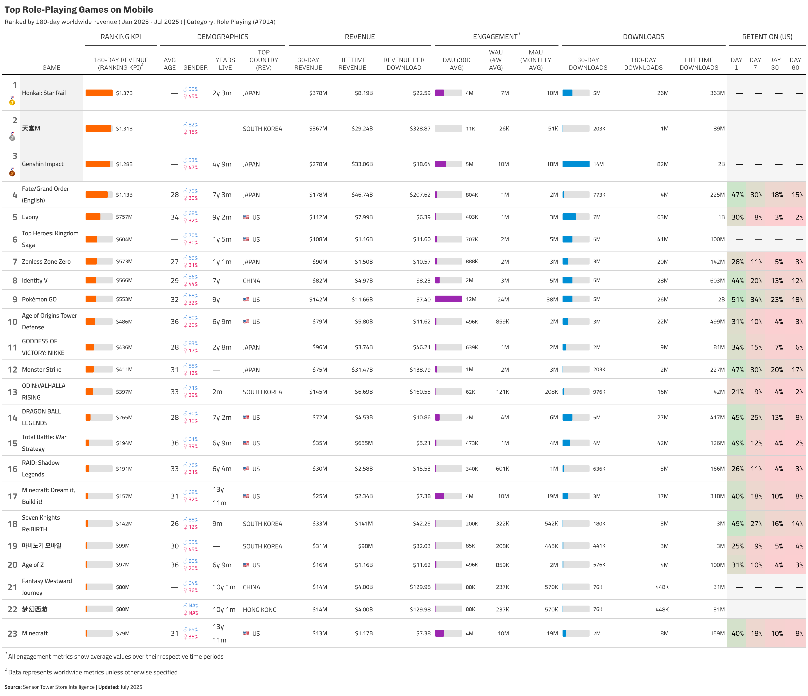

# sensortowerR

<p align="center"></p>

An R package for interfacing with the Sensor Tower API to fetch mobile app analytics data, including app info, publisher details, revenue/download estimates, and active user metrics.

## Installation

```r
# Install from GitHub
devtools::install_github("econosopher/sensortowerR")
```

## Authentication

Store your Sensor Tower API token as an environment variable:

```r
# Edit your R environment file
usethis::edit_r_environ()

# Add this line (replace with your actual token):
# SENSORTOWER_AUTH_TOKEN="YOUR_SECRET_TOKEN_HERE"

# Restart R session for changes to take effect
```

The package automatically uses the `SENSORTOWER_AUTH_TOKEN` environment variable.

## Category Codes

Common category codes for use with API functions:

### iOS Categories
- `6000` - Games (general)
- `6014` - Games
- `6016` - Social Networking
- `7001` - Action (games)
- `7002` - Adventure (games)
- `7014` - Role Playing (games)

### Android Categories
- `GAME` - Games
- `SOCIAL` - Social
- `game` - Games (lowercase)
- `game_action` - Action Games
- `game_adventure` - Adventure Games
- `game_role_playing` - Role Playing Games

For a complete list, use `st_categories()` to see available categories.

## Core Functions

- **`st_app_info()`**: Search for apps and get basic information
- **`st_publisher_apps()`**: Get all apps from a specific publisher  
- **`st_metrics()`**: Detailed daily metrics for specific apps
- **`st_top_charts()`**: **Unified function for all top charts** (revenue, downloads, DAU, WAU, MAU)
- **`st_game_summary()`**: **NEW! Game market summary** (aggregated downloads/revenue by categories and countries)

## Quick Examples

### Basic App Search
```r
# Search for apps
clash_info <- st_app_info("Clash Royale")
pokemon_info <- st_app_info("Pokemon GO", limit = 1)
```

### Publisher Apps
```r
# Get all Supercell games
supercell_apps <- st_publisher_apps("560c48b48ac350643900b82d")
```

### App Metrics
```r
# Get recent metrics for a specific app
metrics <- st_metrics(
  unified_app_id = "your_app_id",
  start_date = Sys.Date() - 30,
  end_date = Sys.Date() - 1
)
```

### Top Charts with Enhanced Metrics
```r
# NEW: Unified function for all top charts
# Top apps by revenue (default measure)
top_revenue <- st_top_charts(category = 6000)  # iOS Games

# Top apps by downloads 
top_downloads <- st_top_charts(measure = "units", category = 6000)

# Top Role Playing games by MAU with rich analytics
top_rpg_games <- st_top_charts(
  measure = "MAU",
  category = 7014  # Role Playing category
)

# View enhanced custom metrics (24+ metrics available!)
top_rpg_games %>%
  select(unified_app_name, entities.users_absolute, 
         downloads_180d_ww, revenue_180d_ww, retention_1d_us, rpd_alltime_us) %>%
  head()
```

### Game Market Summary
```r
# NEW: Game market overview analysis
# iOS games market summary (last 7 days)
game_market <- st_game_summary(
  categories = 7001,           # Game category
  os = "ios",                  # iOS platform
  countries = c("US", "GB"),   # Multiple countries
  date_granularity = "daily",  # Daily breakdown
  start_date = Sys.Date() - 7
)

# Analyze market trends
# Note: iPhone and iPad data are automatically combined into iOS
market_trends <- game_market %>%
  group_by(Date) %>%
  summarise(
    Total_Revenue = sum(`iOS Revenue`, na.rm = TRUE),
    Total_Downloads = sum(`iOS Downloads`, na.rm = TRUE)
  )
```

### Create Professional Tables
```r
# Beautiful analytics table
top_rpg_games %>%
  select(unified_app_name, entities.users_absolute, 
         downloads_180d_ww, revenue_180d_ww) %>%
  slice_head(n = 10) %>%
  gt() %>%
  tab_header(title = "Top Role Playing Games") %>%
  fmt_number(columns = c(entities.users_absolute, downloads_180d_ww), 
             decimals = 0, use_seps = TRUE) %>%
  fmt_currency(columns = revenue_180d_ww, currency = "USD", decimals = 0)
```

## NEW: Unified Top Charts Function

The new `st_top_charts()` function combines revenue, downloads, and active user metrics in one simple interface:

```r
# All these use the same function with different measures:
st_top_charts(measure = "revenue", category = 6000)    # Default
st_top_charts(measure = "units", category = 6000)      # Downloads  
st_top_charts(measure = "MAU", category = 7014)        # Monthly Active Users
st_top_charts(measure = "DAU", category = 7014)        # Daily Active Users
```

## Enhanced Custom Metrics

The `st_top_charts()` function extracts comprehensive custom metrics:

## Automatic App Name Lookup

For sales data (revenue/downloads), the package **automatically looks up app names** since the sales endpoint only provides app IDs:

```r
# Sales data automatically gets app names resolved
top_revenue <- st_top_charts(measure = "revenue", category = 6000)
# Returns: "Pokémon GO" instead of just "834731712"
```

**Features:**
- **Automatic**: No manual work required
- **Smart deduplication**: Avoids duplicate API calls  
- **Cross-platform**: Works with iOS App Store IDs and Android package names
- **Graceful fallback**: Uses app ID if lookup fails
- **Progress tracking**: Shows lookup progress for larger datasets

**Available Metrics:**
- **Downloads**: `downloads_180d_ww`, `downloads_90d_us`
- **Revenue**: `revenue_180d_ww`, `revenue_90d_us` 
- **Retention**: `retention_1d_us`, `retention_7d_us`, `retention_30d_us`
- **Monetization**: `rpd_alltime_us`, `arpu_90d_us`
- **Demographics**: `male_share_us`, `female_share_us`
- **Platform**: `ios_share_ww`, `android_share_ww`

## Example Workflow: Squad RPG Analysis

```r
# Load packages
pacman::p_load(char = c("devtools", "gt", "dplyr", "lubridate", "tidyr"))
devtools::load_all()

# Find Role Playing category ID
marvel_info <- st_app_info("Marvel Strike Force", return_all_fields = TRUE, limit = 1)
role_playing_id <- marvel_info %>%
  tidyr::unnest(category_details) %>%
  filter(grepl("Role Playing", category_name)) %>%
  pull(category_id) %>%
  first()

# Get top RPG games with enhanced metrics using unified function
top_rpgs <- st_top_charts(
  measure = "revenue",
  category = role_playing_id
)

```

### Example Output: Top Role Playing Games Analytics Dashboard

The `squad_rpg_analysis_unified.R` example generates a comprehensive analytics dashboard for the top role playing games:

<p align="center"></p>

This dashboard showcases:
- **Monthly and Daily Active Users** - worldwide and US metrics
- **Downloads Performance** - 30-day, 180-day, and all-time totals
- **Revenue Metrics** - comprehensive monetization data
- **Revenue Per Download (RPD)** - key monetization efficiency metric
- **User Retention** - Day 1, 7, and 30 retention rates

Run the full example with:
```r
source("examples/squad_rpg_analysis_unified.R")
```

##  Defaults

The package defaults to simplify usage:

- **OS**: `"unified"` (combines iOS + Android)
- **Region**: `"WW"` (Worldwide) 
- **Date**: Current month start to present
- **Limit**: `20` results
