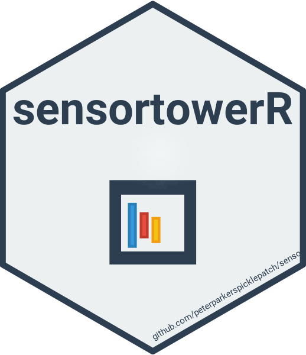

# sensortowerR

<div align="center">
  
</div>

An R package for interfacing with the Sensor Tower API to fetch mobile app analytics data.

## Installation

```r
# Install from GitHub
devtools::install_github("peterparkerspicklepatch/sensortowerR")
```

## Authentication

The package requires a Sensor Tower API authentication token. You can set it in your R environment:

```r
auth_token <- "YOUR_TOKEN_HERE"
```

## Core Functions

- `get_unified_app_info()`: Search for apps and retrieve their basic information
- `fetch_sensor_tower_metrics()`: Fetch metrics for specific apps

## Example Usage

```r
library(sensortowerR)

# Search for Pokemon games
pokemon_games <- get_unified_app_info(
  term = "Pokemon",
  app_store = "unified",
  entity_type = "app",
  limit = 4,
  auth_token = auth_token
)

# Fetch metrics for a specific app
metrics <- fetch_sensor_tower_metrics(
  auth_token = auth_token,
  unified_app_id = "602c795c912b51622f233ffe",  # Pokemon GO
  start_date = ymd("2021-09-22"),
  end_date = ymd("2021-09-22")
)
```

## Dependencies

- tidyverse
- httr
- jsonlite
- logging
- purrr

## License

[License details needed]
